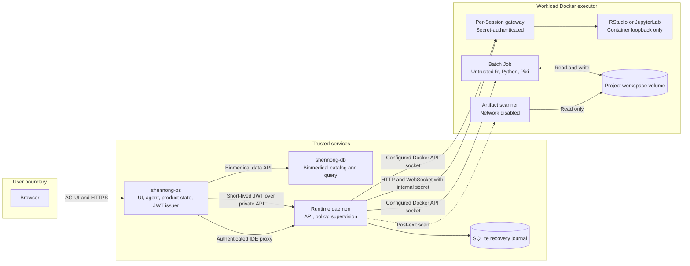

# Shennong Runtime

Shennong Runtime 1.0.0 is the private execution plane for Shennong OS. It
implements a Rust/Axum daemon, a SQLite executor journal, a strict
Job/Session protocol, a mock executor, and a policy-locked Docker executor for
a **dedicated rootless Docker daemon**. The same image also supports an explicit
single-host `simple` mode for the three-container quick deployment.

Shennong OS remains the durable source of truth for users, projects, Jobs,
Artifacts, and Agent Runs. Runtime's SQLite database is a recovery journal, not
a second product database.

## Architecture at a glance



The trust split is deliberate: OS owns user-facing and durable product
state; DB owns biomedical catalog/query data; Runtime alone owns executor
coordination and the configured workload socket. Hardened production uses a
dedicated rootless daemon; opt-in `simple` mode accepts the lower-assurance
system-daemon boundary for a trusted single-user host. Workload code is
untrusted and never receives a host path, Docker socket, control-plane
credential, or direct IDE port. Runtime and DB do not require a direct
service-to-service link.

See [Architecture and design](docs/architecture.md) for component
responsibilities, state ownership, Job and Session lifecycles, deployment
modes, security risks, non-goals, and cross-repository contracts. The exact
wire contract remains [protocol/openapi.yaml](protocol/openapi.yaml), while
[SECURITY.md](SECURITY.md) defines the production acceptance boundary.

## Implemented API

- `GET /v1/health`, `GET /v1/info`
- idempotent submit/get/cancel for Jobs
- cursor-paginated, byte-bounded stdout/stderr/system logs
- validated Artifact manifests generated by a separate networkless scanner
- authenticated, bounded Artifact byte reads that reopen only the owning Job
  volume and revalidate regular-file path, size, and SHA-256
- optional fail-closed compatibility locks over the Result Bundle schema,
  canonical toolchain-manifest digest, and exact Shennong/ShennongData pins;
  requests without a lock remain supported but are explicitly `unbound`
- idempotent start/get/stop for RStudio and JupyterLab Sessions
- live observation of IDE exits/disappearance plus absolute lifetime expiry
- startup and periodic reconciliation of non-terminal executor handles,
  persistent cleanup retries, and instance-scoped orphan removal
- proxy-activity IDE idle expiry and preflight/continuous/final workspace
  usage enforcement that fails closed when usage cannot be measured
- server-side concurrent Job/IDE admission limits with retryable HTTP 429
- stable Job state machine including `timed_out` and `lost`
- digest-verified UTF-8 or base64-decoded binary Project input staging below an
  unguessable per-Job workspace directory (maximum 32 files, 1 MiB per file,
  and 1 MiB decoded total)

The complete contract is [protocol/openapi.yaml](protocol/openapi.yaml).

## Security boundary

Workload code is untrusted, including code generated by an Agent and package
installation hooks. The daemon therefore constructs Docker requests itself;
JobSpec and SessionSpec cannot provide an image, Docker volume, host path,
network name, device, port binding, capability, or privileged flag.

Enforced by the Rust daemon:

- `deny_unknown_fields` on every submitted protocol object;
- opaque `ws_...` workspace references authorized by JWT claims;
- server-side worker profiles with digest-pinned images and resource ceilings;
- direct argv only, with shell executables rejected;
- `workspace-input://...` argv references must resolve to an OS-supplied,
  digest-verified input; the executor rewrites them only after staging through
  a stopped, networkless helper container into the Project's named volume;
- only the `internet_only` network policy in v1;
- non-root UID/GID `65532:65532`;
- `cap_drop=ALL`, `no-new-privileges`, read-only root filesystem;
- Docker default seccomp profile, private IPC, empty devices/binds/port bindings;
- CPU, memory, swap, PID, timeout, tmpfs, log, and Artifact limits;
- no Docker socket or host mount in a workload container;
- IDE backends bind only to container loopback; an authenticated per-Session
  gateway alone binds to a random host `127.0.0.1` port;
- scanner container uses `network=none`, a read-only workspace mount, and
  directory-relative `O_NOFOLLOW` opens for every matched file.
- Artifact reads use a second networkless, read-only helper with `openat`,
  `O_NOFOLLOW`, regular-file checks, a 64 MiB response ceiling, and manifest
  size/SHA-256 revalidation.

Hardened mode refuses `/var/run/docker.sock` and `/run/docker.sock`, then
queries Docker at startup and fails closed unless it reports rootless mode,
seccomp, and delegated cgroup v2 CPU/memory/PID controls. Production must use a
rootless daemon dedicated to Runtime workloads. `simple` mode is opt-in and
accepts the system socket for a trusted single-user host; possession of that
socket is equivalent to host-level Docker administration.

Hardened network policy has two layers:

1. the executor attaches batch Jobs only to `shennong-job-egress` and publishes
   no ports;
2. a root-owned, automatically restored nftables policy blocks new inbound traffic and all
   loopback, RFC1918, CGNAT, link-local, metadata, documentation, multicast, and
   reserved destinations while retaining public internet egress.

The Runtime Daemon never receives `CAP_NET_ADMIN`. A root systemd path unit
watches the dedicated RootlessKit `child_pid`, reapplies the policy inside each
new network namespace, and atomically publishes a root-owned attestation only
after both expected bridges and the exact proxy `/32` are verified. Runtime
compares that attestation with the live `child_pid` before health succeeds or a
Job/Session launches, so a missing, stale, racing, or failed policy is fail-closed.

## JWT contract

All Job and Session routes require an OS-issued bearer JWT. Runtime validates:

- an explicitly configured `HS256`, `EdDSA`, or `RS256` algorithm;
- signature, `iss`, and `aud=shennong-runtime`;
- required `sub`, `jti`, `iat`, and `exp`, plus `nbf` enforcement when present;
- maximum lifetime (`120s` by default);
- endpoint scopes and the exact `workspace_refs` allowlist; wildcard scopes and
  wildcard workspace claims are rejected.

Ed25519 verification is the V1 production Compose default. HS256 with the
built-in development key is rejected when the Docker executor is selected. The
file-backed HS256 path is retained solely for rollback compatibility with an
existing legacy OS deployment and is outside the V1 acceptance profile;
`SHENNONG_JWT_HS256_SECRET` remains local-mock-only so it is not exposed by
`docker inspect`.

Example claims:

```json
{
  "iss": "shennong-os",
  "aud": "shennong-runtime",
  "sub": "user_123",
  "iat": 1784290000,
  "exp": 1784290060,
  "jti": "run_123:job_1",
  "scopes": ["runtime:jobs:write", "runtime:jobs:read"],
  "workspace_refs": ["ws_yP2JukjK4Y"]
}
```

## Local mock development

The safe default executor is `mock`; it never connects to Docker:

```bash
cargo run
curl http://127.0.0.1:7000/v1/health
cargo test
```

The default local JWT secret is development-only. API integration tests create
short-lived JWTs and cover audience rejection, strict schemas, idempotency,
shell rejection, logs, Artifacts, IDE target redaction, HTTP proxying, and
WebSocket proxying. Unit tests also inspect the staged tar contract, including
private file modes and the per-Job input root.

## Simple single-host mode

The unified `zerostwo/shennong-runtime` image also supports the top-level
three-container quick deployment by setting
`SHENNONG_RUNTIME_DOCKER_MODE=simple`. This mode may use the trusted host's
system Docker socket and creates two labeled bridge networks when absent. It
retains Runtime-built non-root containers, seccomp/cgroup checks, resource
limits and separate Job/Session networks, but it does **not** require rootless
mode, the root-owned nftables attestation, or a private listen address.

`simple` is therefore a convenience profile for a trusted single-user host,
not the hardened production acceptance profile. The Docker socket grants
daemon-wide administration, and `internet_only` does not have the hardened
mode's attested private-destination filtering. Use the rootless profile below
for hostile or multi-user workloads.

Run the release-quality local checks from the repository root:

```bash
cargo fmt --all -- --check
cargo clippy --locked --all-targets --all-features -- -D warnings
cargo test --locked --all-targets
docker buildx build --check --file container/runtime.Dockerfile .
docker compose --file deployments/docker/compose.rootless.yaml config --quiet
bash -n scripts/verify-live-runtime.sh
shellcheck scripts/verify-live-runtime.sh
```

## Rootless production profile

1. Create a dedicated Linux account and install rootless Docker prerequisites.
2. As that account, run `bash scripts/install-rootless-daemon.sh`.
3. Point `DOCKER_HOST` at the printed dedicated socket and run
   `bash scripts/bootstrap-rootless-executor.sh`.
4. As root, review and run `scripts/install-egress-policy-guard.sh` with the
   executor UID and exact Runtime proxy `/32`. This installs the root systemd
   service/path pair and performs the first policy reconciliation.
5. Run `bash scripts/verify-egress-policy.sh` with a digest-pinned Python image
   and a live private Runtime health URL. The verification requires IDE-to-
   control-plane denial as well as host-to-IDE proxy reachability.
6. Supply one digest-pinned `SHENNONG_RUNTIME_IMAGE` and validate
   `deployments/docker/compose.rootless.yaml` with `docker compose config`.
7. After the final images are deployed, run the live Runtime acceptance gate
   from a trusted host that can reach the private API:

   ```bash
   DOCKER_HOST=unix:///run/user/<runtime-uid>/shennong-runtime-docker/docker.sock \
   SHENNONG_LIVE_RUNTIME_URL=http://<private-runtime-address>:7000 \
   SHENNONG_LIVE_JWT_PRIVATE_KEY_FILE=/srv/shennong.one/secrets/runtime-jwt-ed25519-private.pem \
   bash scripts/verify-live-runtime.sh
   ```

   The key path must be the OS Ed25519 signing key corresponding to Runtime's
   mounted public key. Its host mode may be `0600` or the deployment-standard
   `0640` with a dedicated secrets group; group write/execute and all world
   permissions are rejected. The script creates only short-lived bearer tokens,
   keeps them in a mode-`0600` temporary directory, and never prints them. It
   refuses the system Docker socket and a daemon that does not report rootless mode.
   Two fresh workspace volumes are preflighted as absent and removed only when
   their exact managed labels still match. It verifies staged file contents,
   logs and Artifact digest; nonzero, timeout and cancellation states;
   idempotency; owner/workspace isolation; and the running container's locked
   HostConfig. Run `scripts/verify-egress-policy.sh` separately because network
   policy behavior is an independent gate.

   Runtime restart recovery is deliberately opt-in because deployments use
   different supervisors. Set `SHENNONG_LIVE_ENABLE_RESTART=1` and
   `SHENNONG_LIVE_RESTART_ACK=restart-runtime-daemon-only`, together with
   `SHENNONG_LIVE_RESTART_HOOK=/absolute/path/to/operator-reviewed-hook`. The
   hook receives no arguments and must synchronously restart only the trusted
   Runtime daemon, not the rootless workload daemon. The gate proves the
   rootless engine and in-flight workload identity were preserved, then verifies
   the same Job ID reaches success with recovered logs.

The canonical three-repository single-host integration is documented by the
[Shennong OS V1 deployment guide](https://github.com/zerostwo/shennong-os/blob/v1.0.0/deploy/README.md).

Before accepting a production worker, run both `scripts/verify-egress-policy.sh`
and `scripts/verify-live-runtime.sh` against the live private Runtime address,
launch and stop both IDE kinds through Shennong OS, restart the rootless daemon,
and repeat the policy/health check. The exact deployed image digests and Runtime
instance ID belong in the deployment rollback record, never only in shell
history.

The Compose profile uses host networking only for the trusted daemon so it can
reach rootless IDE loopback ports. It publishes no Compose port and requires an
explicit private control-bridge listen address; Docker mode rejects `0.0.0.0`
and public addresses. Shennong OS is the only expected Runtime API client.

## Image

`container/runtime.Dockerfile` produces `zerostwo/shennong-runtime`, containing
the daemon, trusted batch entrypoint/scanner, R, Python, Pixi, RStudio Server,
and JupyterLab. Runtime selects the role by overriding the entrypoint and
command for each workload. The older split Dockerfiles remain as migration
references but are no longer published.

### Built-in toolchain

The unified image exposes the following tools to batch Jobs and IDE Sessions:

| Tool | Image contract | Pinning and purpose |
| --- | --- | --- |
| R | `4.6.x` | Signed CRAN Debian Bookworm repository; the Docker build rejects another R minor series |
| Shennong | `0.2.0.9000` at commit `c1d958d` | Analysis package installed from a checksum-verified source archive |
| ShennongData | `0.2.0.9000` at commit `1ce7f7d` | Governed OS/DB R client installed from a checksum-verified source archive |
| Python | `3.11.x` | Debian Bookworm `python3`; the Docker build rejects another Python minor series |
| Pixi | `0.54.2` | Exact digest-pinned Pixi stage; manages reproducible Project environments |
| Node.js | `24.16.0` | Exact digest-pinned final base image; available to workloads and support tooling |
| JupyterLab | `4.6.1` | Exact Python package pin in `/opt/jupyter`; launched through the protected IDE gateway |
| RStudio Server | `2026.07.0+139` | Exact downloaded `.deb` plus SHA-256 verification; launched through the protected IDE gateway |

R and Python are intentionally expressed as minor-version contracts because
their package revisions can receive security updates during an image rebuild.
The immutable published image digest is the source of truth for the exact
patch/build revision. Verify a candidate image with `R --version`,
`python3 --version`, `pixi --version`, `node --version`, and
`jupyter lab --version` before promoting its digest. The image preinstalls only
the hard dependencies of Shennong and ShennongData. Optional analysis backends
such as Seurat, SingleR, CellChat, and decoupleR remain Project dependencies and
must be declared and locked through Pixi.

Both packages' read-only MCP entry points are available through
`Shennong::sn_mcp_server()` and `ShennongData::sn_mcp_serve()`. Their Agent
Skills are installed under `/opt/shennong/agent/skills`, and the image build
performs real JSON-RPC `initialize` and `tools/list` smoke tests. The resulting
package, MCP-tool, R-version, and Skill inventory is recorded in
`/opt/shennong/runtime-r-toolchain.json` for candidate-image verification and
is exposed as `r_toolchain` by the live `GET /v1/info` endpoint.
The manifest records the source commits supplied by the checksum-verified
Docker build. Runtime canonicalizes it, exposes `r_toolchain_sha256` and
`package_commits` through both system endpoints, requires it for Docker mode,
and compares every field when a Job supplies `compatibility_lock`.

### Compatibility-locked result handoff

A new Job may bind itself to
`shennong.dev/analysis-result-bundle/v1`, the live canonical toolchain-manifest
SHA-256, and the exact Shennong/ShennongData version and commit pairs. Any
explicit mismatch fails admission. Omitting the lock preserves legacy behavior,
but the Job response says `compatibility_status=unbound`; Runtime never
mislabels it as verified.

A locked Job must declare exactly one required Artifact rule with role
`analysis_result_bundle`. Before success, Runtime reads that JSON through the
same bounded Artifact byte path and validates the Shennong-owned top-level
contract, a successful validation record, non-empty immutable input references
with revision and SHA-256, provenance, and output roles/digests against the
scanner manifest. Credential-like fields are recursively rejected. This is a
candidate-result integrity boundary only: Runtime keeps no DB credential,
does not upload bytes to ShennongDB, and does not claim that OS promotion or an
end-to-end analysis succeeded.

Production profiles should use one `repository@sha256:...` reference. The image
defaults to Posit's official RStudio Server `2026.07.0+139` Ubuntu 22 amd64
package at
`https://download2.rstudio.org/server/jammy/amd64/rstudio-server-2026.07.0-139-amd64.deb`,
verified as SHA-256
`e7b310c9e46811635b8dea8df82c729686c3a78f35cfa7767d9567e30f528465`.
The checked-in Rust, Node, and Pixi defaults use reviewed manifest-list digests.
Rust `1.97` is a build stage only and is not part of the workload toolchain.

## Session proxying

The rootless executor maps only an authenticated IDE gateway to a random host
`127.0.0.1` port. RStudio/Jupyter themselves listen on container loopback. Each
Session receives an OS-random 256-bit secret: Runtime persists the raw value,
injects it only into upstream HTTP/WebSocket handshakes, and gives the container
only its SHA-256 digest. The gateway requires exactly one matching header using
a constant-time comparison and consumes it before forwarding. The target and
secret stay inside Runtime's SQLite journal and are omitted from API responses.
Runtime exposes `/v1/sessions/<id>/proxy/*`, validates the OS JWT, owner, scope,
workspace and running state, then streams HTTP or WebSocket traffic to loopback.
Session responses return only `proxy_path`.

Shennong OS must expose each IDE on an origin isolated from the OS application
(preferably a per-Session hostname), with host-only OS authentication cookies,
strict Origin/CSRF validation, CSP and frame restrictions. Serving untrusted
notebook/IDE content under the OS application origin is forbidden: its scripts
would inherit same-origin authority over OS APIs. The OS proxy must also strip
its authentication cookies; Runtime performs a second exact-name filter from
the required `SHENNONG_OS_AUTH_COOKIE_NAMES`, removes upstream Cookie `Domain`,
and scopes IDE cookies to the Session path.

Runtime strips the OS bearer token and untrusted forwarding/RStudio headers,
then rewrites Origin/Referer after OS validation. It revokes already-established
HTTP/WebSocket streams at terminal state, records throttled bidirectional proxy
activity for atomic idle expiry, and independently enforces absolute Session
TTL. The IDE role uses the same proxy base path so redirects and WebSocket URLs
stay routable. The dedicated rootless executor account and its Docker socket
remain trusted infrastructure credentials.

## Current v1 limitations

- single-node SQLite executor journal;
- Docker and mock executors only; no GPU or distributed scheduler;
- no online environment resolver endpoint yet;
- OS must poll terminal Job state to durably resume an Agent Run;
- rootless Docker, systemd policy recovery, and nftables behavior must be
  validated on the actual worker host before production use;
- `max_workspace_bytes` is a supervised usage ceiling, not a kernel-enforced
  per-volume quota. Keep the dedicated Docker data root on a hard-quota
  filesystem to bound bursts and daemon-outage windows; the worker must remain
  disposable and separate from control-plane storage.

## License

Shennong Runtime is licensed under the [MIT License](LICENSE).
