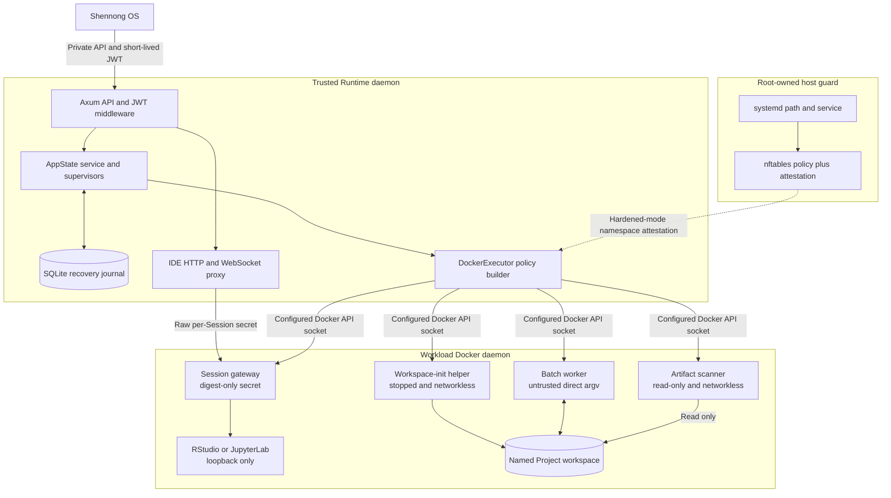
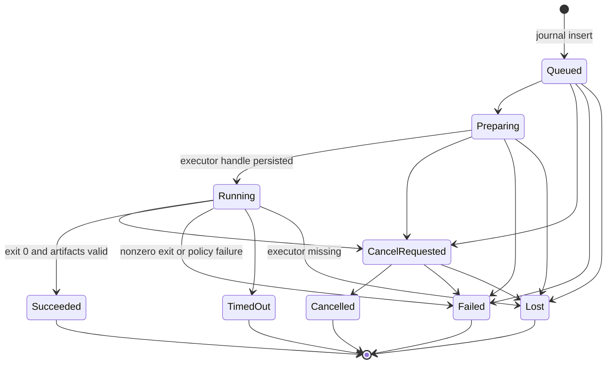
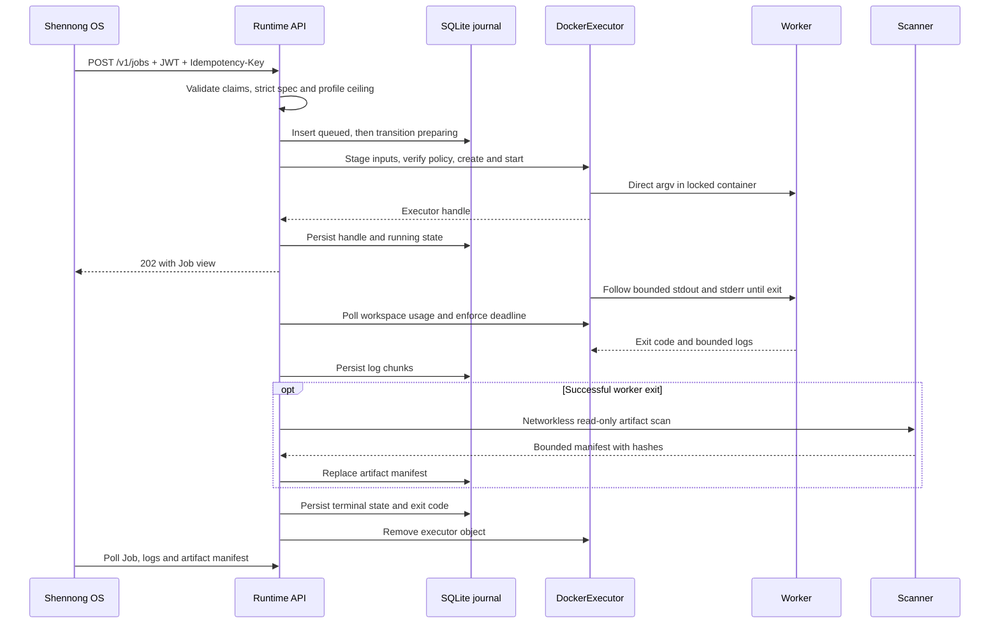
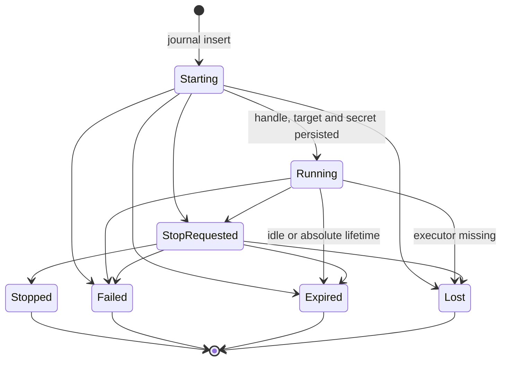

# Shennong Runtime architecture and design

This document describes the checked-in Runtime V1 implementation. It is a
design record, not a roadmap: implemented but untagged changes belong in
[CHANGELOG.md](../CHANGELOG.md) under `Unreleased`, while proposals must not be
presented here as current behavior. The normative HTTP schema is
[protocol/openapi.yaml](../protocol/openapi.yaml), and
[SECURITY.md](../SECURITY.md) is the production security checklist.

## Role in Shennong

Shennong Runtime is a private execution plane. It accepts bounded Job and IDE
Session specifications from Shennong OS, turns them into policy-owned Docker
requests, supervises the resulting executor objects, and keeps enough local
state to reconcile after a daemon restart.

Runtime is intentionally not the Shennong product database:

| System | Owns | Must not own |
| --- | --- | --- |
| `shennong-os` | Users, projects, threads, Agent Runs, durable Job/Artifact product records, browser authentication, OS-issued Runtime JWTs | The workload Docker socket or direct executor control |
| `shennong-runtime` | Admission, executor policy, operational Job/Session state, bounded logs/manifests, executor handles, cleanup and restart reconciliation | Users, projects, agent memory, biomedical catalog data, or a public browser session |
| `shennong-db` | Biomedical catalog, query and governed data-service state | Runtime scheduling, workspace volumes, IDE proxying, or Runtime credentials |

There is no required Runtime-to-DB connection. OS and its agent tools call DB
through the DB API and call Runtime through the Runtime API. A workload cannot
use Runtime's private network to reach DB; the production egress policy blocks
private and control-plane destinations.

## Design goals

- Treat every Job command, generated script, package hook, notebook and IDE
  process as untrusted.
- Keep the Docker administration credential out of OS, DB and workload
  containers; make the lower-assurance `simple` exception explicit.
- Make all caller-controlled protocol objects strict, bounded and idempotent.
- Preserve enough operational state to resume supervision or fail explicitly
  after a Runtime restart.
- In hardened mode, fail closed when rootless, seccomp, cgroup or egress-policy
  prerequisites are absent or stale.
- Give RStudio and JupyterLab one authenticated proxy path without exposing an
  IDE backend or its internal bearer secret to OS.

## Component model

### Trusted daemon

`src/main.rs` loads and validates configuration, builds `AppState`, reconciles
the executor before binding the listener, starts periodic maintenance, and then
serves the Axum router. The main internal layers are:

- `src/api.rs`: public health/info routes and authenticated Job/Session routes;
- `src/auth.rs`: signature, issuer, audience, time, scope and workspace claim
  validation;
- `src/service.rs`: admission, state transitions, monitors, expiry, cleanup and
  restart reconciliation;
- `src/journal.rs`: versioned SQLite schema and operational persistence;
- `src/executor.rs`: mock and Docker executor implementations;
- `src/proxy.rs`: authenticated HTTP/WebSocket forwarding to one journaled
  loopback target.

The daemon is trusted because its configured Docker socket can create, stop and
inspect every resource in that Docker daemon. In hardened mode this is a
dedicated rootless workload daemon; in `simple` mode it may be the system daemon
on a trusted single-user host. A read-only bind mount does not make a Unix
socket read-only; process and network isolation are the actual controls.

### Unified image roles

`container/runtime.Dockerfile` publishes one `zerostwo/shennong-runtime` image
containing the daemon, batch entrypoint, artifact scanner, IDE supervisor,
gateway, R, Python, Pixi, RStudio Server and JupyterLab. The image entrypoint
starts the daemon by default and supplies deployment defaults. DockerExecutor
overrides the entrypoint/command for batch, scanner and IDE roles.

One image simplifies distribution and lets every role use one reviewed digest;
it does not collapse their runtime trust boundaries. The daemon container holds
the Docker socket, while Job/Session/helper containers receive only their
role-specific locked HostConfig. The older split Dockerfiles remain migration
references and are no longer published.

#### Toolchain contract and ownership

The unified workload contract is R `4.6.x`, Python `3.11.x`, Pixi `0.54.2`,
Node.js `24.16.0`, JupyterLab `4.6.1`, and RStudio Server `2026.07.0+139`.
Pixi, Node.js, JupyterLab, and RStudio are exactly pinned in
`container/runtime.Dockerfile`; the Pixi and Node stages are also digest-pinned,
and the RStudio package is checksum-verified. The Docker build asserts the R,
Python, and Pixi version contracts before publishing the image.

Python comes from Debian Bookworm and R comes from CRAN's signed Debian
Bookworm repository. Their minor series are stable by contract, while package
revisions may change when security-fixed packages are installed during a
rebuild. Therefore a promoted
`repository@sha256:...` digest, together with version output captured from that
candidate image, is the exact runtime bill of materials. Documentation must not
claim a patch version that the Dockerfile does not pin.

The global image provides the language launchers, R's standard/recommended
installation, the isolated Jupyter environment, and commit-pinned
Shennong/ShennongData packages. Their hard dependencies are installed globally;
optional method backends remain Project dependencies in a declarative Pixi
environment and lock. Each image build verifies the two packages, their
read-only MCP tool lists, and their installed Skill assets, then writes the
observed inventory to `/opt/shennong/runtime-r-toolchain.json`.
The public `GET /v1/info` response exposes that validated document as
`r_toolchain`, allowing the deployed image rather than its Dockerfile to prove
which package, MCP, R, and Skill surface is live.

### Batch role and helpers

The batch role uses R, Python, Pixi and a fixed Python entrypoint from the
unified image. Runtime passes a direct executable argv; the entrypoint calls
`execvp` and never starts a shell. Runtime, not the caller, selects the
digest-pinned image, UID/GID, network, volume, resource limits and HostConfig.

OS-resolved project inputs are bounded UTF-8 `workspace_files` in `JobSpec`.
Runtime verifies their SHA-256 digests and stages them below an unguessable
per-Job directory through a stopped networkless helper. A caller can reference
only those files with `workspace-input://...`; it cannot submit a host path or
Docker volume name.

After a successful worker exit, a separate helper scans the workspace with
`network=none` and a read-only mount. It rejects symlinks and escaping paths,
bounds path traversal, file count and aggregate bytes, hashes each artifact,
and returns a manifest. Runtime does not expose an artifact-bytes endpoint.

### IDE role and gateway

`container/ide/launch_ide.py` supervises either RStudio Server or JupyterLab.
The selected IDE binds to `127.0.0.1` inside the container. A Rust gateway is
the only process bound to the container port, and that port is published only
to a random `127.0.0.1` port on the rootless daemon host.

Runtime generates a 256-bit Session secret and stores the raw value only in its
journal. The container receives the SHA-256 digest. Runtime injects the raw
secret into upstream HTTP and WebSocket requests; the gateway compares its
digest in constant time, consumes the secret header, and then forwards to the
loopback IDE. API responses contain only `proxy_path`, never the loopback target
or secret.

## State ownership and persistence

| State | Owner and persistence | Recovery rule |
| --- | --- | --- |
| Product Job, Artifact and Agent Run records | OS database | OS remains the durable source of truth and polls Runtime to converge terminal state |
| Runtime Jobs and Sessions | Runtime SQLite journal | Operational mirror used for idempotency, supervision, logs, manifests and restart reconciliation |
| Executor handles | Runtime journal plus Docker labels | Persist the handle before returning `running`; labels include stable Runtime instance and object kind |
| Workspace contents | Named volume on the selected workload daemon | Back up only explicitly allowlisted project volumes; Runtime's supervised byte ceiling is not a filesystem quota |
| Containers and helper objects | Dedicated rootless daemon in hardened mode; selected host daemon in simple mode | Terminal cleanup is retried; instance-scoped unknown objects are removed after helper grace rules |
| Runtime JWT signing key | OS only | Runtime mounts only the Ed25519 public key in the V1 production profile |
| IDE Session gateway secret | Runtime journal | Raw value is never serialized; proxy authorization is revoked at terminal state |
| Biomedical catalog/query data | DB service | Never copied into Runtime's journal |

SQLite migrations are idempotent and run on connection. Losing the journal does
not erase OS product records, but it removes Runtime's idempotency history,
executor handles, logs/manifests and Session secrets; restore it together with
the deployment metadata and explicitly selected workspaces.

## Job lifecycle

Important semantics:

- `Idempotency-Key` is scoped to the caller subject. Reuse with an identical
  request returns the existing Job; reuse with a different request is a
  conflict.
- Admission uses an in-process semaphore. Capacity exhaustion returns retryable
  HTTP 429 before a durable waiting queue is created; `queued` is an initial
  state, not a distributed scheduler queue.
- The current Docker implementation follows logs while the container runs but
  writes the collected bounded chunks to SQLite during finalization. Callers
  must not assume live log delivery while a Job is still running.
- Timeout, cancellation, workspace overage and repeated usage-measurement
  failures stop the workload and persist an explicit terminal state.
- The executor handle is persisted before `running` is returned. If persistence
  fails, Runtime cancels and removes the just-created workload.
- Terminal cleanup is idempotent and retried by reconciliation when needed.

## Session lifecycle and proxy path

Session admission validates the same owner/workspace/profile boundaries as a
Job, then starts the IDE container and probes both unauthenticated rejection and
authenticated gateway readiness. Runtime persists the executor handle,
loopback target and raw secret before returning `running`.

The browser path is:

1. the browser authenticates to OS on an IDE-specific origin;
2. OS validates browser authentication plus Origin/CSRF policy and strips its
   cookies before forwarding;
3. OS calls `/v1/sessions/{id}/proxy/...` with a short-lived
   `runtime:sessions:proxy` JWT;
4. Runtime rechecks subject, workspace and running state, strips authorization
   and configured OS cookies, rewrites Origin/Referer, and injects the internal
   Session secret;
5. the gateway authenticates Runtime and forwards only to the loopback IDE.

Proxy traffic atomically refreshes idle activity at a throttled interval.
Stopping, expiry, failure or loss revokes existing HTTP/WebSocket streams. An
absolute lifetime remains independent of proxy activity.

## Restart reconciliation

Reconciliation runs once before the API starts and periodically afterward. It:

1. retries terminal Job and Session cleanup records;
2. collects active journal records and known executor handles;
3. removes old instance-labeled executor objects unknown to the journal;
4. observes each active Job/Session and resumes a monitor when the object still
   exists;
5. retries a requested cancellation/stop, marks a missing object `lost`, and
   enforces Session expiry;
6. refuses to adopt more active objects than configured concurrency permits.

The stable `SHENNONG_RUNTIME_INSTANCE_ID` prevents orphan cleanup from crossing
Runtime instances that share an executor daemon. Sharing that daemon is still
discouraged because the socket remains daemon-wide authority.

## Socket, network and resource boundaries

### Docker boundary

Both Docker modes require seccomp and cgroup v2 CPU, memory and PID controls.
Hardened mode additionally rejects the system sockets, requires a dedicated
rootless daemon, requires a loopback/private Runtime listen address and enables
the root-owned egress-policy guard. OS and DB run on the separate control-plane
daemon and never mount the hardened workload socket.

`simple` mode accepts an explicitly configured system socket and does not
require rootless mode or the egress attestation. That socket can administer OS,
DB and every other container on the same daemon even though workloads never see
it. The mode is therefore limited to a trusted single-user host and is not an
equivalent security boundary.

Runtime constructs every Docker request. Submitted specs cannot select an
image, volume, host path, network, capability, device, bind, privileged mode or
port mapping. Workloads run as `65532:65532` with all capabilities dropped,
`no-new-privileges`, a read-only root filesystem, private IPC, bounded tmpfs,
no devices/binds, and server-ceiling CPU, memory, PID, time, log, artifact and
workspace limits.

### Network boundary

Jobs and Sessions use distinct bridge networks. Hardened mode requires
pre-created, exactly named and labeled bridges; simple mode creates and validates
its own labeled local bridges when absent. Batch Jobs publish no ports. IDE
containers publish only the authenticated gateway to Docker-host loopback.
Workspace-init and artifact-scanner helpers use `network=none` in both modes.

In hardened mode, root-owned systemd units watch the current RootlessKit
`child_pid`, install the nftables policy inside that exact network namespace,
and atomically write an attestation only after the expected bridges and exact
Runtime proxy `/32` are verified. Runtime checks the attestation before health
succeeds and before each launch. A missing, mutable, stale or racing attestation
is a launch failure.

The policy blocks new inbound traffic and private, loopback, metadata,
link-local, CGNAT, multicast, documentation and reserved destinations while
retaining public internet egress. The behavioral verification script is part of
production acceptance because configuration inspection alone cannot prove the
live namespace policy. Simple mode has no equivalent filter or attestation, so
its `internet_only` request value must not be interpreted as verified denial of
private destinations.

### Resource boundary

Server-owned worker profiles are absolute ceilings; a request can only ask for
less. Concurrent Job and Session limits are separate. Workspace usage is
checked before launch, periodically during execution, at worker exit and during
Session supervision. Three consecutive measurement failures fail closed.

`max_workspace_bytes` is supervision, not a kernel quota. The workload daemon's
data root therefore needs a hard filesystem quota to bound short bursts and
daemon-outage windows.

## Deployment modes

### Local mock

`SHENNONG_EXECUTOR=mock` is the default. It uses a local SQLite journal and no
Docker socket, and is intended for API development and tests. Its built-in
HS256 secret is development-only.

### Simple single-host

Set `SHENNONG_RUNTIME_DOCKER_MODE=simple` for the top-level three-container
quick deployment on a trusted single-user host. The unified Runtime image can
run the daemon and all dynamically launched worker/scanner/IDE roles. Simple
mode may use `/var/run/docker.sock` or `/run/docker.sock`, creates the two
managed bridge networks when absent, and keeps the role-specific locked
HostConfig and resource ceilings.

Simple mode deliberately omits the rootless check, root-owned nftables policy,
current-namespace attestation and hardened private-listen validation. Operators
must restrict the Runtime listener themselves and accept that compromise of the
daemon grants control of the host Docker engine. This mode is for convenience,
not hostile multi-user workloads or the V1 production acceptance gate.

### Hardened rootless production

The checked-in production profile is
`deployments/docker/compose.rootless.yaml`. It runs the trusted daemon container
on host networking so it can reach the random rootless-host loopback ports used
by IDE gateways. It publishes no Compose port and accepts only an explicit
loopback or private control-bridge listen address.

The same unified image supplies daemon, worker, scanner and IDE roles. Set one
immutable `SHENNONG_RUNTIME_IMAGE=repository@sha256:...` for the daemon and
server-owned worker profiles even though Compose provides a convenient `latest`
default. The default JWT algorithm is Ed25519; the HS256 Compose override exists
only for legacy rollback and is outside the V1 production acceptance profile.

The deployment sequence and required live gates are documented in
[deployments/docker/README.md](../deployments/docker/README.md). A dedicated
worker VM can strengthen host isolation, but it does not remove the requirements
for a dedicated rootless daemon, private Runtime API and live policy checks.

## Security risks and residual controls

| Risk | Implemented control | Remaining operator responsibility |
| --- | --- | --- |
| Docker socket compromise | Runtime alone receives the socket; hardened mode uses a dedicated rootless daemon; workload requests stay locked | Keep hardened OS/DB off that daemon; simple mode can control the shared host daemon and is trusted-host only |
| Container or kernel escape | Hardened rootless daemon, non-root workloads, seccomp, no capabilities, no-new-privileges | Patch host/kernel/runtime; simple mode has a larger host blast radius; prefer a dedicated worker VM |
| Private-network or metadata access | Hardened root-owned nftables policy, current-namespace attestation and behavioral gate | Re-run hardened verification after daemon/host/network changes; simple mode provides no equivalent guarantee |
| Malicious package/image supply chain | Server-owned digest-pinned unified image and reviewed build inputs | Review digests, SBOMs and advisories; one compromised image affects every role; do not accept caller images |
| IDE same-origin privilege | Loopback IDE, internal gateway secret, Runtime header/cookie filtering | OS must use a separate IDE origin, host-only auth cookies, strict Origin/CSRF, CSP and frame policy |
| Workspace exhaustion | Supervised byte ceiling and fail-closed measurement | Enforce a hard quota on the workload data root and monitor free space |
| Journal loss or rollback | Versioned SQLite migrations and unified backup guidance | Back up journal, deployment metadata and selected workspaces consistently; test restore |
| Secret leakage | Short-lived exact-scope JWTs; public-key verification; raw Session secret never serialized | Protect OS signing keys and Runtime journal; do not log bearer tokens or secrets |

Rootless Docker reduces host impact but is not a proof that hostile native code
is harmless. Simple mode has a materially larger Docker and network blast
radius. Runtime also does not inspect scientific correctness, package licenses,
exfiltration to reachable endpoints, or the contents of generated artifacts.

## Non-goals and current limitations

- no public Runtime endpoint or direct browser-to-Runtime authentication;
- no general-purpose Docker API and no caller-selected images or networks;
- no durable product database, user/project directory or agent memory;
- no Runtime-to-DB coupling or private DB access from workloads;
- no GPU scheduling, multi-node scheduler, distributed queue or HA journal;
- no online environment resolver endpoint;
- no kernel-enforced per-volume quota in Runtime;
- no artifact-byte download API;
- no guarantee of live log visibility before Job finalization;
- no browser-origin security enforcement in Runtime; OS owns that boundary;
- no hardened rootless or private-destination guarantee in `simple` mode.

## Cross-repository contracts

### OS to Runtime

- Use the exact [OpenAPI contract](../protocol/openapi.yaml) and
  `api_version=shennong.dev/v1`.
- Issue a short-lived JWT with fixed algorithm, `iss`,
  `aud=shennong-runtime`, `sub`, `jti`, `iat`, `exp`, exact endpoint scopes and
  an exact `workspace_refs` allowlist. Wildcards are invalid.
- Use stable, owner-scoped idempotency keys and treat HTTP 429 and executor
  unavailability as retryable according to the error envelope.
- Resolve governed project text files in OS, verify their project authorization,
  and send only the bounded `workspace_files` payload. Never send a host path.
- Poll Job terminal state and copy the operational result into OS's durable
  Agent Run, Job and Artifact records.
- Put IDE traffic on a separate origin, validate browser Origin/CSRF and strip OS
  auth cookies before calling Runtime's proxy path.

### Runtime to OS

- Return opaque IDs, state, bounded logs, artifact manifests and proxy paths;
  never return Docker IDs, host paths, loopback targets or Session secrets.
- Keep `/v1/health` dependent on the journal, executor and current egress-policy
  attestation so OS can stop admission when the worker boundary is unhealthy.
- Preserve stable state names and error-envelope semantics within API V1.

### DB separation

- DB APIs and schemas are independent of Runtime API V1.
- OS or an agent tool may use DB results to construct governed inputs or Job
  argv, but Runtime never receives DB credentials and cannot resolve DB-internal
  identifiers.
- Any future direct Runtime-to-DB path is a trust-boundary change requiring a
  new design review; it must not be introduced as an undocumented convenience.

Breaking API/state changes require a SemVer-major release and coordinated OS
consumer work. Backward-compatible additions require synchronized Rust models,
OpenAPI schemas, API tests, this design document and `CHANGELOG.md`.

## Design-change checklist

Before merging a change that affects execution or trust boundaries:

1. trace the affected symbols and call paths with CodeGraph;
2. update Rust models and `protocol/openapi.yaml` together;
3. add tests for state transitions, strict input rejection and restart behavior;
4. validate locked Docker HostConfig and live rootless policy behavior when the
   executor contract changes;
5. update this document, README diagrams, SECURITY/deployment guidance and the
   `Unreleased` changelog entry;
6. run the repository validation commands documented in `AGENTS.md`.
